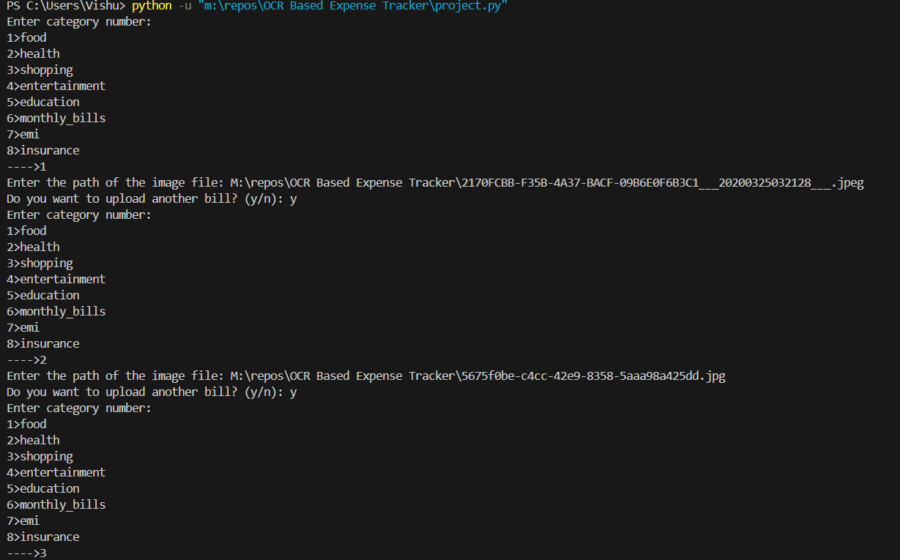
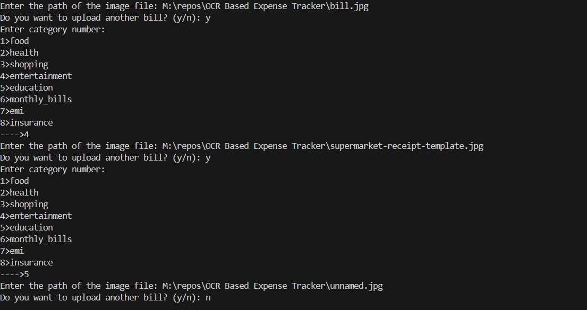
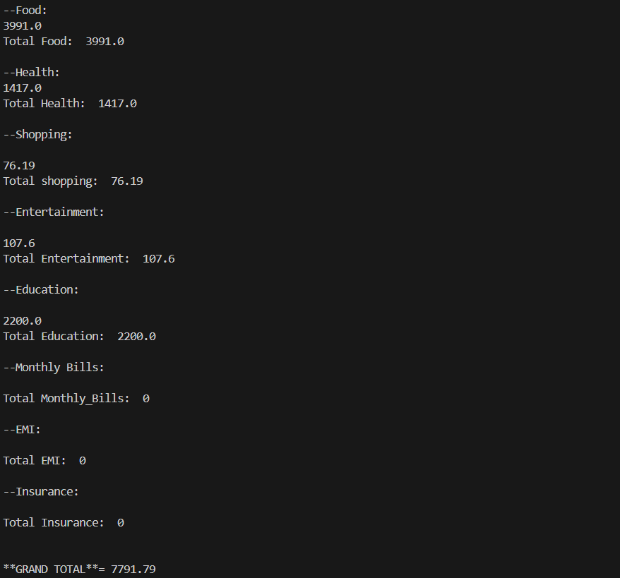
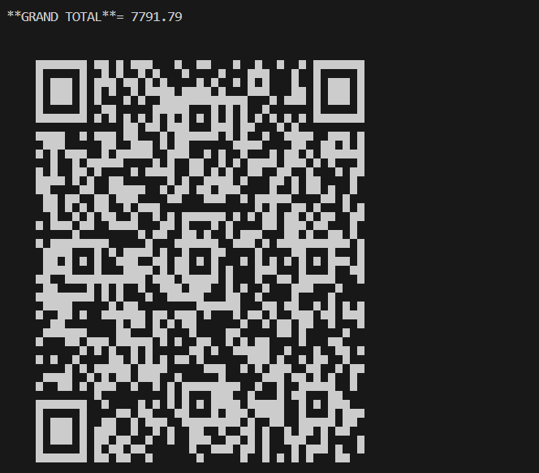

# OCR-Based Expense Tracker
===========================

## Overview
-----------

The OCR-Based Expense Tracker is a Python-based application that uses Optical Character Recognition (OCR) technology to extract relevant information from receipts and invoices, and track expenses. This project aims to provide an efficient and automated way to manage expenses, reducing the need for manual data entry.

## Features
------------

* **Receipt Scanning**: Users can upload receipts or invoices, which are then processed using OCR technology to extract relevant information such as date, amount, and category.
* **Expense Tracking**: Extracted information is stored in a database, allowing users to track their expenses over time.
* **Category Management**: Users can create and manage categories for their expenses, making it easier to track spending habits.
* **Reporting**: The application provides a reporting feature, which generates a summary of expenses by category and date range.

## Screenshots
--------------

--------------

## License
---------

This project is licensed under the MIT License. See [LICENSE](LICENSE) for details.
